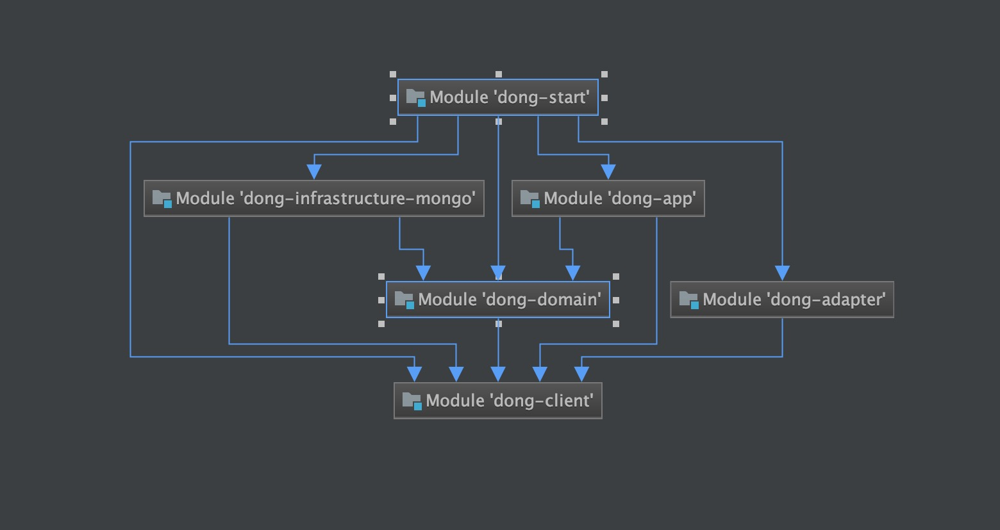

## 一个cola 4.0 Demo

dong-start 启动工程

### 下面是依赖关系

##### dong-infrastructure-mongo 依赖 dong-domain
##### dong-infrastructure-mysql 依赖 dong-domain
##### dong-app 依赖 dong-domain dong-client
##### dong-adapter 依赖 dong-client
##### dong-start 依赖 dong-app、dong-adapter、dong-infrastructure-mongo或dong-infrastructure-mysql